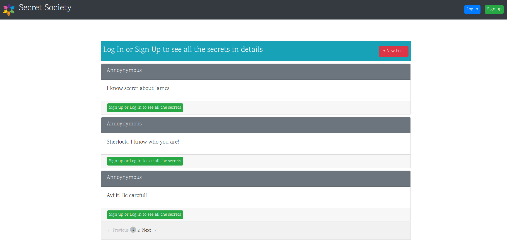
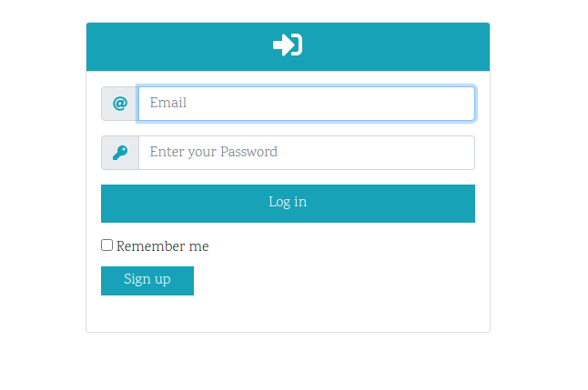
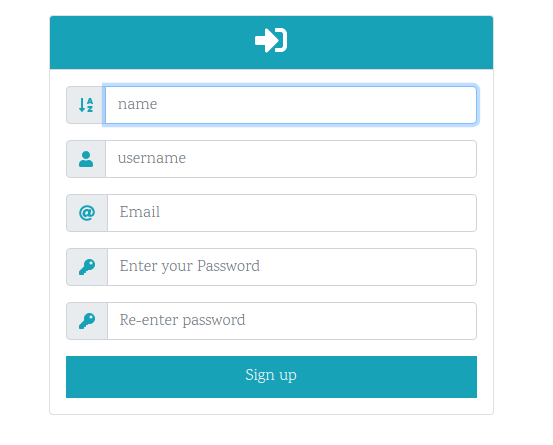
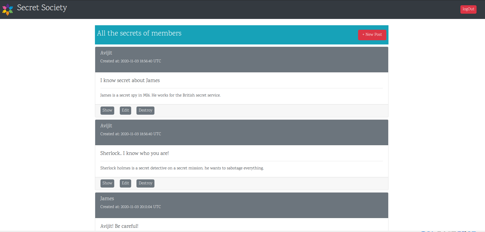

# Members_only (secret society)

> This is a rail project where I built an application with the backend  which is needed to store the information from users and posts with focus on the authentication. In this application if the author is authenticated then he/she can see who wrote each post and discover all the secret.






## Features
In this project we developed a simple app with authentication:

- The form uses Bootstrap library for css combined with embedded ruby code
- The back end is set up with a User and Post model that validates presence of username, email and password, using devise gem and validates the presence of Post's description.
- I used devise to perform user's authentication, creating the corresponding actions such as Log in, Log out,Sign up.
- If user check the page without being authenticated, he/she will not be able to see the post's authors and the timestamps from the posts, but it displays when user Log in or Sign up
- Any user who signed up can create own posts.
- Pagination is used for visual appeal.

## Built With

- Ruby on Rails
- Ruby
- Rubocop
- Atom text editor
- Devise gem
- Bootstrap
- Will paginate gem

# Getting Started

To get a local copy of the repository please run the following commands on your terminal:

```
$ cd <folder>
```

```bash
$ git clone `https://github.com/ajkacca457/members_only.git`
$ cd members_only
$ bundle install
$ yarn install --check-files if yarn is not updated
$ Run `rails db:migrate` to create necessary tables in database
$ Run `rails server` to see the user interface.
$ Open your browser and go to http://localhost:3000/
```

# Authors

👤 **Avijit Karmaker**

- Github: [@Avijit](https://github.com/ajkacca457)
- Linkedin:[@Avijit](https://www.linkedin.com/in/avijit-karmaker-8738a54)

## 🤝 Contributing

Contributions, issues and feature requests are welcome!

## Show your support

Give a ⭐️ if you like this project!
